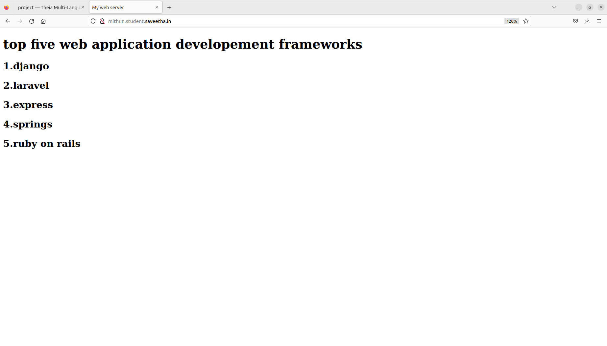
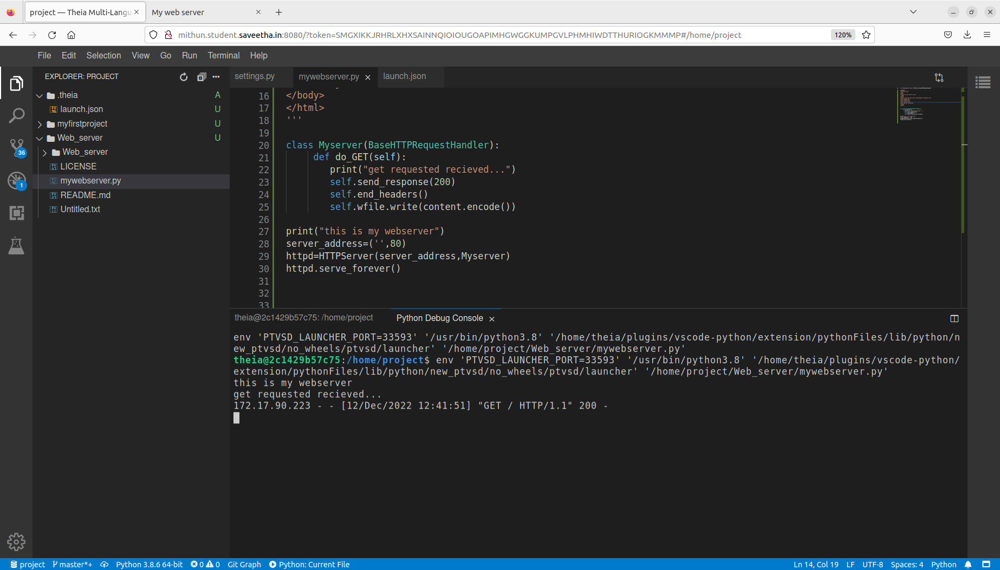

# Developing a Simple Webserver
## AIM:
To develop a server to display top five web application developement frameworks

## DESIGN STEPS:
### Step 1: 
HTML content creation
### Step 2:
Design of webserver workflow
### Step 3:
Implementation using Python code
### Step 4:
Serving the HTML pages.
### Step 5:
Testing the webserver

## PROGRAM:
from http.server import HTTPServer,BaseHTTPRequestHandler

content='''
<!doctype html>
<html>
<head>
<title> My web server</title>
</head>
<body>
<h1>top five web application developement frameworks</h1>
<h2>1.django</h2>
<h2>2.laravel</h2>
<h2>3.express</h2>
<h2>4.springs</h2>
<h2>5.ruby on rails</h2>
</body>
</html>
'''

class Myserver(BaseHTTPRequestHandler):
     def do_GET(self):
        print("get requested recieved...")
        self.send_response(200)
        self.end_headers()
        self.wfile.write(content.encode())

print("this is my webserver")
server_address=('',80)
httpd=HTTPServer(server_address,Myserver)
httpd.serve_forever()

## OUTPUT:
### client side

### server side

## RESULT:
is developed to display a top five web application developement frameworks
